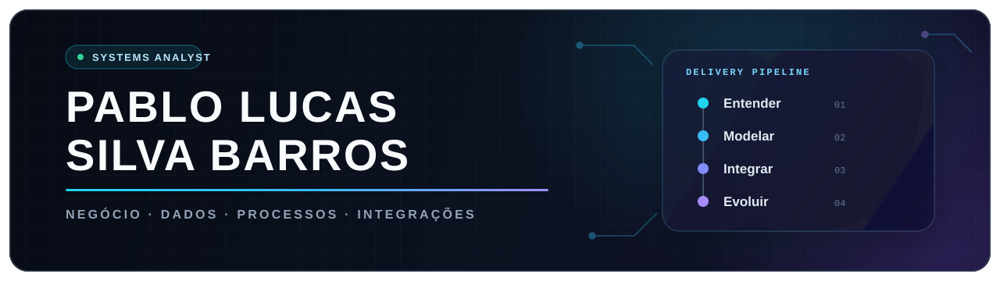

<picture>
  <source media="(prefers-color-scheme: dark)" srcset="./assets/header-dark.svg">
  <source media="(prefers-color-scheme: light)" srcset="./assets/header-light.svg">
  
</picture>

<div align="center">

<p><strong>Transformo complexidade operacional em soluções conectadas, rastreáveis e prontas para evoluir.</strong></p>

Analista de Sistemas com foco na conexão entre **negócio, dados, processos e tecnologia**.

</div>

---

## `> perfil`

Atuo na interseção entre **negócio e tecnologia**: compreendo processos, estruturo informações e conecto plataformas para apoiar a evolução contínua de sistemas corporativos.

Meu repertório reúne **Oracle, SQL, PL/SQL, APIs REST, C#/.NET, BPM e BPMN 2.0**, além da vivência com **ERP Senior Sapiens, GAtec e SoftExpert**.

Valorizo soluções **claras, confiáveis, rastreáveis e fáceis de manter** — tecnologia aplicada a problemas reais, com arquitetura preparada para continuar evoluindo.

```text
NEGÓCIO  →  PROCESSOS  →  DADOS  →  INTEGRAÇÕES  →  SISTEMAS
entender     modelar       organizar   conectar        evoluir
```

## `> frentes_de_atuacao`

| Frente | Como contribuo |
| :--- | :--- |
| **Análise de Sistemas** | Traduzo necessidades de negócio em requisitos, fluxos e direcionamentos técnicos claros. |
| **Dados & Informação** | Estruturo e manipulo informações com Oracle, SQL, PL/SQL e modelagem de dados. |
| **Integrações** | Conecto sistemas e plataformas por meio de APIs REST e fluxos de integração. |
| **Processos & Automação** | Mapeio processos com BPM/BPMN 2.0 e identifico oportunidades de automação. |
| **Arquitetura & Entrega** | Organizo a evolução de soluções com versionamento, práticas DevOps e CI/CD. |

## `> stack_principal`

<div align="center">

<p>
  
  
  
  
  
  
  
  
</p>

</div>

### Ecossistema corporativo

`ERP Senior Sapiens` · `GAtec` · `SoftExpert` · `Integração de sistemas` · `Arquitetura de sistemas` · `DevOps` · `CI/CD`

### Temas que acompanho

`Inteligência Artificial aplicada a sistemas` · `IoT`

## `> principios`

- **Entender antes de construir:** o problema e o processo vêm antes da ferramenta.
- **Integrar com propósito:** sistemas conectados devem reduzir atrito e aumentar clareza.
- **Projetar para evoluir:** manutenção, rastreabilidade e sustentabilidade fazem parte da solução.
- **Entregar valor real:** tecnologia só faz sentido quando melhora a execução do negócio.

<details>
<summary><strong>English summary</strong></summary>
<br>

Systems Analyst working at the intersection of **business, data, processes and technology**. My focus is understanding operational needs, structuring information and connecting platforms through reliable, maintainable solutions.

Core areas: `Oracle` · `SQL` · `PL/SQL` · `REST APIs` · `C#/.NET` · `BPM/BPMN 2.0` · `Systems Integration`

</details>

---

<div align="center">

## Vamos transformar complexidade em soluções que funcionam?

Aberto a conexões e oportunidades em **análise de sistemas, integrações, dados, automação e transformação digital**.

Você pode acompanhar meus projetos e minha evolução diretamente neste perfil.

</div>

<!--
Quando houver projetos públicos confirmados, inclua aqui de 2 a 3 projetos com:
problema, solução, seu papel, tecnologias e uma evidência concreta do resultado.
Evite cards de estatísticas até que eles reforcem — e não enfraqueçam — a narrativa do perfil.
-->
